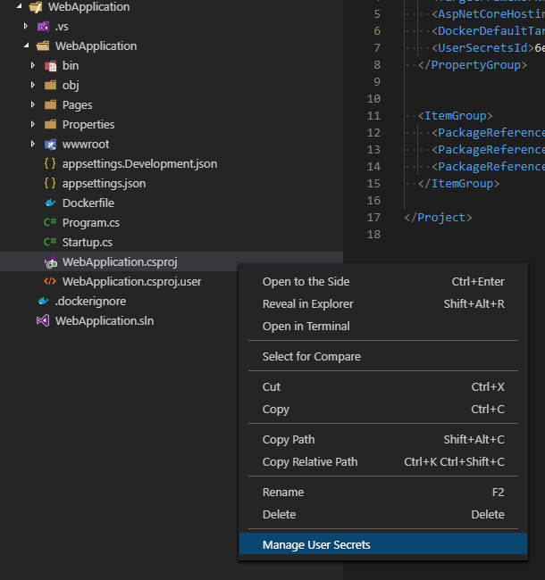

# Manage User Secrets

View and manage User Secrets in ASP .NET and .NET Core Apps.

## Features

Adds an option to the Context Menu when right-clicking `.csproj` files. This menu option opens up the `secrets.json` file for editing.

## User Secrets

Learn more about User Settings [here](https://docs.microsoft.com/en-us/aspnet/core/security/app-secrets).

## Extension Settings

No settings are supported at this time.

## Issues

Report issues [here](https://github.com/Reptarsrage/vscode-manage-user-secrets/issues).

## Release Notes

### 1.0.0 (March 19, 2019)

- Initial release!
